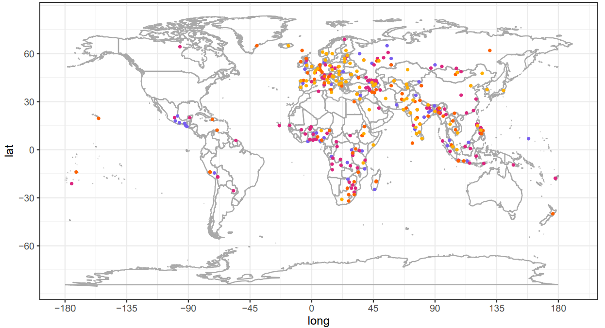

# Goldfish: Monolingual language models for 350 languages

<b>Goldfish</b> is a suite of 1154 <b>monolingual</b> language models trained for <b>350 languages</b>.
The models are trained on 5MB, 10MB, 100MB, and 1GB of text in each language when available, after accounting for the fact that some languages require more UTF-8 bytes than others to encode comparable text.
When 1GB of text is not available for a language, we also release a "full" model trained on our entire dataset for that language.
The Goldfish reach lower perplexities than state-of-the-art multilingual models for many low-resource languages ([Chang et al., 2024](https://github.com/tylerachang/goldfish/blob/main/goldfish_paper_20240815.pdf)), and they can be used as baselines, fine-tuning sources, or augmentations to larger models for low-resource NLP research.
Google Colab demo [here](https://colab.research.google.com/drive/1rHFpnQsyXJ32ONwCosWZ7frjOYjbGCXG?usp=sharing) (no technical background required!).

<picture>

</picture>

For training and evaluations details, see our paper, [Goldfish: Monolingual Language Models for 350 Languages (Chang et al., 2024)](https://github.com/tylerachang/goldfish/blob/main/goldfish_paper_20240815.pdf).
In the current repository, we include the original training and evaluation code, dataset and evaluation info (`data` directory), and model details (`model_details.json`).
See `data` for 
The available Goldfish languages are listed in `constants.py`.

To use the Goldfish models, we recommend using the models available on Hugging Face: https://huggingface.co/goldfish-models

We provide sample code in `example_generate_text.py` and `example_score_text.py`, or in a browser through [this](https://colab.research.google.com/drive/1rHFpnQsyXJ32ONwCosWZ7frjOYjbGCXG?usp=sharing) Google Colab.
Each Goldfish model is 125M parameters at the largest, which can easily be run on a free Google Colab GPU or even on CPU.

## Citation.
<pre>
@article{chang-etal-2024-goldfish,
  title={Goldfish: Monolingual Language Models for 350 Languages},
  author={Chang, Tyler A. and Arnett, Catherine and Tu, Zhuowen and Bergen, Benjamin K.},
  journal={Preprint},
  year={2024},
}
</pre>

